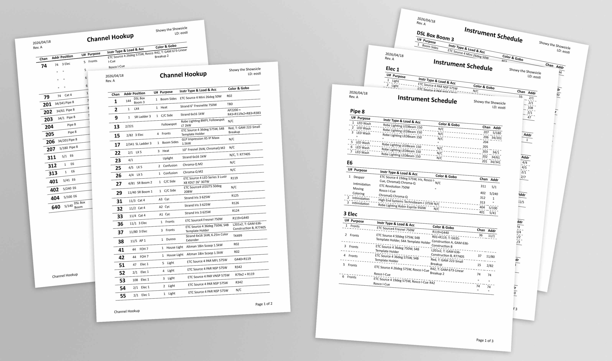

# Lighting Paperwork
Pretty lighting paperwork generation from Vectorworks to PDF or Excel!

Using a Vectorworks Spotlight Data Exchange XML file or a Vectorworks lighting export, this program will generate a channel hookup, instrument schedule, color cut list, and gobo pull list.
This can either be exported as a PDF, HTML file, or Excel spreadsheet, all of which are neatly formatted for your viewing and printing convenience.

# Installation
Using [pipx](https://pipx.pypa.io/stable/): `pipx install lighting-paperwork`

Using [uv](https://docs.astral.sh/uv/): `uvx lighting-paperwork`

# Usage
`lighting-paperwork` needs a source of data from Vectorworks.
There are currently two options to generate this:

- (preferred) Enable Vectorworks Data Exchange in Spotlight > Spotlight Settings > Spotlight Preferences > Lightwright and check "Use automatic Lightwright data exchange" and "Perform a full export to Lightwright when dialog box closes". Additionally, move all "Available Fields" over to "Export Fields". This will create a `[filename].xml` file in the same directory as your Vectorworks file
  - This only needs to be performed once, the `.xml` file will stay updated to the Vectorworks file
  - Lightwright cannot run in the same directory or else it will consume the `.xml` file. To fix, run another full export while Lightwright is not running
- Manual export in File > Export > Lighting Device Data. Select all entries, leave "Export field names as first record" checked, and export to a `.csv` file.
  - Accessories will not export using this method

To generate paperwork, run `lighting-paperwork my-show.xml` to generate a PDF.
The `--show`, `--ld`, and `--revision` flags are quick ways to add show metadata from the command line, ex. `lighting-paperwork my-show.xml --show "My Amazing Show" --ld "ME" --revision "Rev. C"`.

## Configuration
To see all valid configurations options, use `lighting-paperwork --help`.

While all options can be passed as command-line arguments, a configuration file may be useful to avoid repeated data entry.
A `paperwork.yaml` file can be created alongside the `.xml` file which contains reused configuration options.
Command-line arguments will override `paperwork.yaml` settings if ad-hoc adjustments are required.

When using `paperwork.yaml`, no arguments are required to `lighting-paperwork`.
If a different settings file name is desired, that can be passed as a positional argument, ex. `lighting-paperwork settings.yaml`
An example `paperwork.yaml` is provided as [settings.yaml](./settings.yaml) for reference; however for a full list of customization options refer to the help function.

## Customization
Much of what this program does is fairly opinionated to my own use case and my sense of what looks nice on paperwork.
That said, there are some customization options available through the `paperwork.yaml` configuration file.

If you want to customize the paperwork in a way that hasn't been exposed yet, please file a bug report and we'll see what can be done.

# Disclaimer
This is a tool that I developed for myself, for my shows, which means I can only confirm that it has worked for this somewhat limited dataset.
As such, please **don't** rely on this as your primary paperwork generation method, and be sure to verify its outputs against your plot.
I use it, I'm happy with it, but I'm not a professional lighting designer and I haven't run into every situation possible -- this program could get confused with new numbering schemes, break on the latest version of Vectorworks, or just not like the instruments that you're using.
If you need something reliable, trusted, and industry-standard, go buy a copy of [Lightwright](https://www.lightwright.com/) instead.

# Contribution
Found an issue or want an additional feature?
Please submit a issue (or even better, a PR)!
